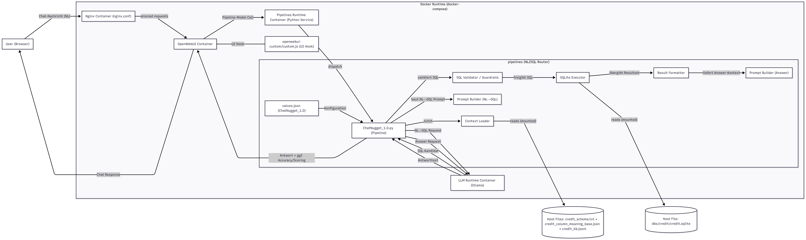
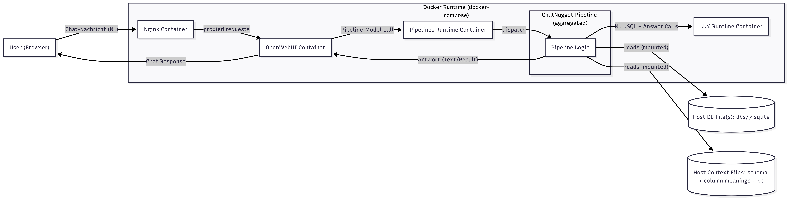
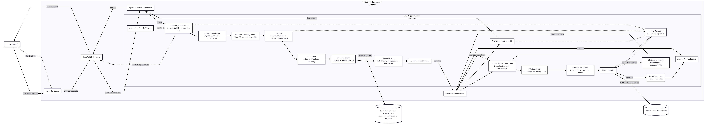

# Architekturdiagramme

Diese Seite sammelt die wichtigsten Architekturansichten des Systems (OpenWebUI + Pipelines + LLM + SQLite/Host-Files) und verlinkt die jeweiligen Diagramme als PNG.

---

## 1) Architekturdiagramm (Systemübersicht)
Zeigt die zentralen Komponenten und den Datenfluss auf Systemebene (User → OpenWebUI → Pipelines → LLM/DB → zurück).

---

## 2) Aggregierte Übersicht (High-Level)
Sehr kompakte Sicht: Docker-Stack und externe/host-basierte Artefakte (DB-Dateien, Kontextdateien) mit den wichtigsten Datenflüssen.

---

## 3) Only Pipeline (Detailansicht Pipeline)
Fokussiert ausschließlich den internen Ablauf der Pipeline (NL→SQL, Guardrails, Execution, Answer, optionale Loops).

---

## 4) Komplettes Architekturdiagramm (Full Detail)
Gesamtsicht inkl. detaillierter Pipeline-Teilbereiche und sämtlicher Flüsse/Abhängigkeiten.

---

## 5) C4 Komponenten Diagramm
C4-orientierte Darstellung der Komponenten/Container und ihrer Beziehungen (für Dokumentation & Architektur-Reviews).

